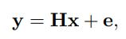

Thus, it is important for deep-learning-based denoisers to use high quality noiseless ground truth data for
high performance. However, it is often challenging or even infeasible to obtain noiseless images in some applications. Here, we
propose a method based on Stein’s unbiased risk estimator (SURE) for training DNN denoisers based only on the use of noisy images
in the training data with Gaussian noise. We demonstrate that our SURE-based method, without the use of ground truth data, is able to
train DNN denoisers to yield performances close to those networks trained with ground truth for both grayscale and color images. We
also propose a SURE-based refining method with a noisy test image for further performance improvement. Our quick refining method
outperformed conventional BM3D, deep image prior, and often the networks trained with ground truth. Potential extension of our
SURE-based methods to Poisson noise model was also investigated

### K. Dabov, A. Foi, V. Katkovnik, and K. Egiazarian, “Image denoising by sparse 3-D transform-domain collaborative filtering,” 

Deep learning based image denoisers have yielded performances that are equivalent to or better than those of
conventional state-of-the-art denoising techniques such as BM3D.

These deep denoisers typically train their networks by minimizing the mean-squared error (MSE) between the output of a network and a ground truth (noiseless) image. Thus, it is crucial to have high quality noiseless
images for high performance denoising. Thus far, DNN
denoisers have been successful since high quality camera
sensors and abundant light allow the acquisition of high
quality, almost noiseless 2D images in daily environment
tasks. Acquiring such high quality photographs is quite
cheap with the use of smart phones and digital cameras.

### In deep learning based image processing such as image denoising or single image super resolution, it is often more efficient to use image patches instead of whole images for training. 
For example, x(j) and y(j) can be image patches from a ground truth image and a noisy image, respectively

### Super resolution problem, CNNs, reconstruction

For instance, in the SR task, it is common to train the CNNs to reconstruct x from y that is observed using a bicubic down-sampling kernel

In many image-restoration tasks the observed image y can be expressed by the following linear model, where H ∈ R m×n is a measurement operator with m ≤ n,
and e ∼ N (0, σ2 Im) is an additive white Gaussian noise. For example, when H is a blur operator, it is a deblurring problem, and when H is an anti-aliasing filtering followed by sub-sampling it is a super-resolution (SR) problem.

Image restoration problems represented by (1) are usually ill-posed, in the sense that fitting the measurements y alone is not enough for a successful reconstruction of x. Therefore, the use of some prior assumptions on x is inevitable.
