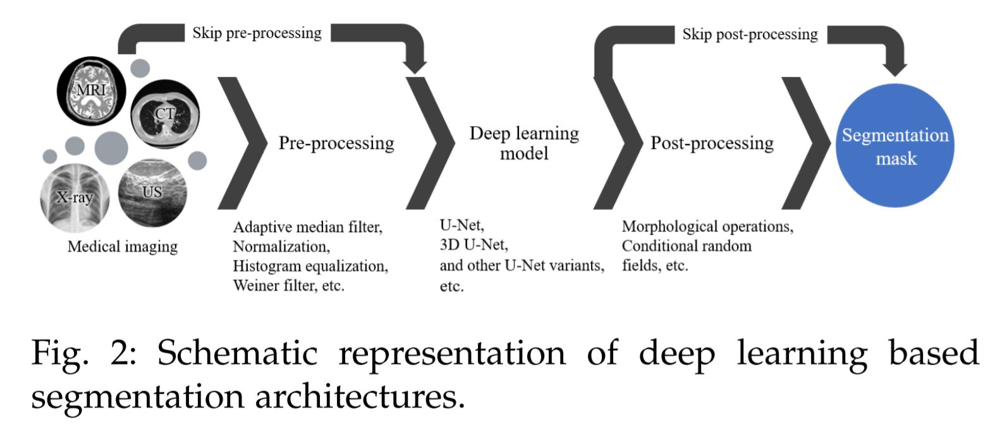
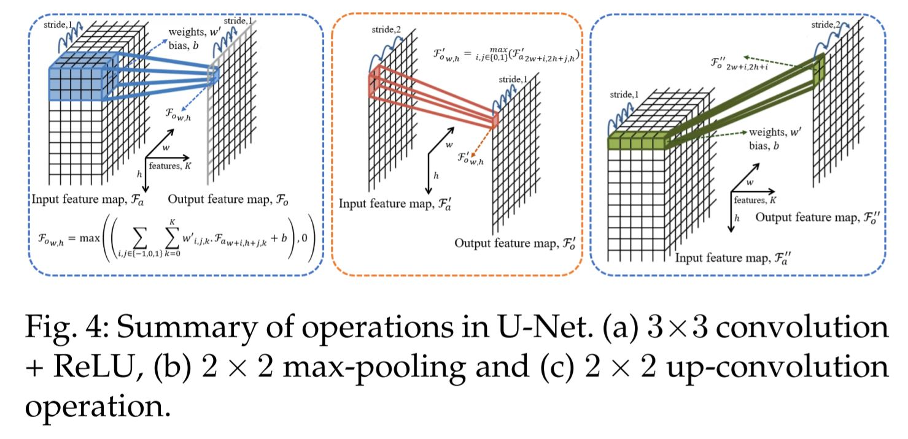

## Segmantation 관련 논문 입니다

### Segmentation Scheme

---

### Semantic segmentation VS Instance segmentation

The semantic segmentation [9] segregates the objects belonging to different classes, whereas instance segmentation [10] goes deeper to also segregate the objects within the common class

---

# Head and Neck Tumor Segmentation Challenge 2020

[Overview of the HECKTOR Chanllenge at MICCAI 2020: Automatic Head and Neck Tumor Segmentation in PET/CT](https://www.researchgate.net/publication/348453198_Overview_of_the_HECKTOR_Challenge_at_MICCAI_2020_Automatic_Head_and_Neck_Tumor_Segmentation_in_PETCT)

[Automatic segmentation of head and neck tumors and nodal metastases in PET-CT scans](https://openreview.net/pdf?id=1Ql71nEERx)

[Squeeze-and-excitation normalization for automated delineation of head and neck primary tumors in combined PET and CT images](https://arxiv.org/pdf/2102.10446.pdf)

#### SENet의 영감을 받아 만들어진 AGCNN

[Attention-guided convolutional neural network for detecting pneumonia on chest x-rays](https://ieeexplore.ieee.org/stamp/stamp.jsp?arnumber=8857277&tag=1)

[Combining CNN and hybrid active contours for head and neck tumor segmentation](https://arxiv.org/pdf/2012.14207.pdf)

[Two-stage approach for segmenting gross tumor volume in head and neck cancer with CT and PET imaging](https://www.programmersought.com/article/36287421048/)

---

[Automatic Head and Neck Tumor Segmentation in PET/CT with Scale Attention Network](https://www.medrxiv.org/content/10.1101/2020.11.11.20230185v1.full.pdf)

### Encoding Path Way

The encoding pathway is built upon ResNet [16] blocks, where each block consists of two Convolution-Normalization-ReLU layers followed by additive identity
skip connection.

***We keep the batch size to 1 in our study to allocate more GPU
memory resource to the depth and width of the model, therefore, we use instance normalization, i.e., group normalization [21] with one feature channel in
each group, which has been demonstrated with better performance than batch
normalization when batch size is small.***

In order to further improve the representative capability of the model, we add a squeeze-and-excitation module [14] into
each residual block with reduction ratio r = 4 to form a ResSE block. The initial
scale includes one ResSE block with the initial number of features (width) of 24.
We then progressively halve the feature map dimension while doubling the feature width using a strided (stride=2) convolution at the first convolution layer of
the first ResSE block in the adjacent scale level. All the remaining scales include two ResSE blocks and the endpoint of the encoding pathway has a dimension of 384 × 8 × 8 × 8.

### Decoding Path Way

The decoding pathway follows the reverse pattern of the encoding one, but with
a single ResSE block in each spatial scale. At the beginning of each scale, we use
a transpose convolution with stride of 2 to double the feature map dimension
and reduce the feature width by 2. ***The upsampled feature maps are then added
to the output of SA-block. Here we use summation instead of concatenation for
information fusion between the encoding and decoding pathways to reduce GPU
memory consumption and facilitate the information flowing.*** 

The endpoint of the decoding pathway has the same spatial dimension as the original input tensor and its feature width is reduced to 1 after a 1 × 1 × 1 convolution and a sigmoid function. In order to regularize the model training and enforce the low- and middle level blocks to learn discriminative features, we introduce deep supervision at
each intermediate scale level of the decoding pathway. Each deep supervision subnet employs a 1 × 1 × 1 convolution for feature width reduction, followed by
a trilinear upsampling layer such that they have the same spatial dimension as the output, then applies a sigmoid function to obtain extra dense predictions.
These deep supervision subnets are directly connected to the loss function in order to further improve gradient flow propagation

---

[Iteratively refine the segmentation of head andneck tumor in FDG-PET and CT images]

[Patch-based 3D UNet for head and neck tumor segmentation with an ensemble of conventional and dilated convolutions]

[GAN-based bi-modal segmentation using mumfordshah loss: Application to head and neck tumors in PET-CT images]

[The head and neck tumor segmentation using nnU-Net with spatial and channel squeeze & excitation blocks]

[Tumor segmentation in patients with head and neck cancers using deep learning based-on multi-modality PET/CT images]

[Oropharyngeal Tumour Segmentation using Ensemble 3D PET-CT Fusion Networks for the HECKTOR Challenge]

### Hecktor Challenge 2020 review 논문에서 시사하는 바

According to these criteria, the task is partially solved. The first criterion, evaluating the segmentation at the pixel level, is fulfilled. At the occurrence level
(criteria 2 and 3), however, even the algorithms with the highest DSC output FP and FN regions. These errors are generally made in very difficult cases and
we should further evaluate their source, e.g. Figure 2c and 2d. Besides, there is still a lot of work to do on highly related tasks, including the segmentation of
lymph nodes, the development of super-annotator ground truth as well as the agreement of multiple annotators, and, finally, the prediction of patient outcome
following the tumor segmentation.

Following the analysis of poorly segmented cases, we identified several key elements that cause the algorithms to fail. ***These elements are as follows; low
FDG uptake on PET, primary tumor that looks like a lymph node, abnormal uptake in the tongue and tumor present at the border of the oropharynx region.***
Some examples are illustrated in Figure 1. ***Understanding these errors will lead to better methods and to a more targeted task for the next iteration of this challenge.***

---

# U-Net

[Modality specific U-Net variants for biomedical image segmentation: A survey](https://arxiv.org/pdf/2107.04537.pdf)

U-Net model proposed by Ronnerberger et al. [12], consists of FCN along with the contraction-expansion paths. ***The contraction phase tends
to extract high and low level features, whereas expansion phase follows from the features learned in corresponding
contraction phase (skip connections) to reconstruct the image into the desired dimensions with the help of transposed convolutions or upsampling operations.***

With the sense of segmentation being a classification task where every pixel is classified as being part of the target region or background, Ronneberger et al. [12] proposed
a U-Net model to distinguish every pixel, where input is encoded and decoded to produce output with the same resolution as input. As shown in Fig. 3, the symmetrical arrangement of encoder-decoder blocks efficiently extracts and concatenates multi-scale feature maps, where encoded features are propagated to decoder blocks via skip connections and a bottleneck layer. The encoder block (contraction path) consists of a series of operations involving valid 3 × 3 convolution followed by a ReLU activation function (as shown in Fig. 4(a)), where a 1-pixel border is lost to enable processing of the large images in individual tiles. The obtained feature maps from the combination of convolution and ReLU are downsampled with the help of max pooling operation, as illustrated in Fig. 4(b). Later, the number of feature channels are increased by a factor of 2, following each layer of convolution, activation and max pooling, while resulting into spatial contraction of the feature maps. The extracted feature maps are propagated to decoder block via bottleneck layer that uses cascaded convolution layers. The decoder block (expansion path) consists of sequences of up-convolutions (shown in Fig. 4(c)) and concatenation with high-resolution features from the corresponding encoded layer. The up-convolution operation uses the kernel to map each feature vector to the 2 × 2 pixel output window followed by a ReLU activation function. Finally, the output layer generates segmentation mask with two channels comprising background and foreground classes. In addition, the authors addressed the challenge to segregate the touching or overlapping regions by inserting the background pixels between the objects and assigning an individual loss weight to each pixel. This energy function is represented as a pixel-wise weighted cross entropy function as shown in Eq. 1. 

#### U-Net의 한계점 & Efficient Net 등장 (compound coefficients for uniform scaling in all dimensions)

Considering the present survey it is also observed that each modality requires a different approach to address the
corresponding challenges. Though there are segmentation approaches that are validated on multiple modalities to form generic architectures like nn-UNet, U-Net++, MRUnet, etc. but it is difficult to achieve optimal performance in all segmentation tasks. The main reason is due to the diverse variation in the features corresponding to the target
structures involving lungs nodule, brain tumor, skin lesions, retina blood vessels, nuclei cells, etc. and hence require different mechanism (dense, residual, inception, attention, fusion, etc.) to integrate with U-Net model to effectively learn the complex target patterns. Moreover, the presence of noise or artefacts in different modalities adds another factor to propose different segmentation methods.

Despite U-Net being superefficient for biomedical image segmentation, it certainly has its limits and challenges. One such major challenge is concerned with the computational power requirement which tends to limit the feasibility of the approach. Following this many cloud based high performance computing environments are developed for mobile, efficient and faster computations. Although progress is also made towards the model compression and acceleration techniques [174] with great achievements, however, it is still required to establish the concrete benchmark results for real-time applications. Recently, Tan et al. [175] proposed an ***EfficientNet framework that uses compound coefficients for uniform scaling in all dimensions. This could make U-Net design streamline for complex segmentation tasks with minimal change in the parameters.***

### U-Net model의 deeper layers에서 abstract features of the target structure를 무시해버릴 수도 있다. 

#### Gradient가 diulted 되는 문제가 발생하기 때문이다.

Despite vanilla U-Net being super-efficient in the ISBI cell tracking challenge, there is still a void to fill with improvements in certain aspects. ***The most apparent problem
in the vanilla U-Net is that the learning may slow down in deeper layers of the U-Net model which increases the possibility of the network ignoring the layers representing abstract features of the target structure. This slack in the learning process is due to the generation of diluted gradients in the deeper layers***. Following this context, various U-Net variants are proposed to improve the segmentation performance. These improvements are observed in the form of integration of certain mechanism with U-Net model such as
***1) Network design (ND) - pre-trained, fusion, dense, multitask, residual, cascaded, parallel, nested, deep supervision and attention, 2) Operation design (OD) - Convolution (dilated or atrous and depthwise separable), pooling (spectral and spatial), activation and training loss, and 3) Ensemble design (ED) - combines the multiple design aspects into one model. Most of the U-Net variants falls in the category of ensemble design.*** Hence, for faster and efficient computer-aided diagnosis practices, the following sections present wide varieties of UNet based approaches for biomedical image segmentation using various modalities. Table 5 summarizes the various U-Net variants reviewed in the following sections.

### Transfer Learning은 보편적으로 random하게 initialization을 하는 것보다 좋은 결과를 낸다.

***The transfer learning approachtypically produces better results than the random initialization of the training parameters.***

[A survey on deep learning techniques for image and video semantic segmentation](https://reader.elsevier.com/reader/sd/pii/S1568494618302813?token=9AC0EB4023E03BB67F076FC17124B7200D90ADCE6184EC69F13409E1B7463ADA8BC571FA4C80632BC63704BB0F937F0B&originRegion=us-east-1&originCreation=20210802062602)

### Segmentation에서는 Noise를 추가할 시 모델의 성능을 저하시키는 문제가 발생할 수 있다. 

#### Data Augmentation시 Noise는 추가하지 말자.

The main reason is due to the diverse variation in the features corresponding to the target structures involving lungs nodule, brain tumor, skin lesions,
retina blood vessels, nuclei cells, etc. and hence require different mechanism (dense, residual, inception, attention,
fusion, etc.) to integrate with U-Net model to effectively learn the complex target patterns. Moreover, the presence of noise or artefacts in different modalities adds another factor to propose different segmentation methods

### 부족한 데이터셋을 Data Augmenatation을 함으로써 발생하게 되는 Overfitting

Generally, the image augmentation strategies involve geometric transformations, color space augmentations, kernel filters, mixing images, random erasing, feature
space augmentation, adversarial training, generative adversarial networks, neural style transfer, and meta-learning. However, the diversity of augmented data is limited by
the available data which could result in overfitting.

### Deep Transfer Learning을 적용함으로써 데이터 부족 문제를 해결할 수도 있다.

#### Instances based, Mapping based, Network based, Adversarial based

In another approach, U-Net models utilize transfer learning approaches [177] to optimize the pre-trained model to adapt the targeted task while having insufficient training data.
These deep transfer learning techniques are categories under four broad areas: instances based, mapping based, network based and adversarial based [178]. These approaches
are generally adopted in combinations for practical situations. The potential of this approach attracts many researchers to advance the U-Net based BIS approaches

### Data Imbalance Problem

In BIS (Biomedical Image Segmentation), mostly the datasets are imbalanced i.e. the number of pixels/voxels concerning the target region (region of interest) are relatively less than the dark pixels/voxels (background region), due to which the metrics such as accuracy, which are best suited for a balanced distribution of data samples, are not
recommended for BIS evaluation of the models. Among the discussed metrics intersection-over-union (IoU or Jaccard index) and dice similarity coefficient are the most widely
used evaluation metrics in BIS for various modalities. More details can be found in the recent review articles [8], [11].

The first U-Net model is utilized for CVC segmentation ***by using the exponential logarithmic loss to address the class imbalance problem,*** whereas the other U-Net model tends to extract the anatomical structures to distinguish the ambiguous classes such as PICC and subclavian lines.

### Data Ambiguities -> Solved with probabilisitc U-Net

In the real world scenario, modalities may suffer from inherent ambiguities that coagulate the actual nature of the disease. Following this, Kohl et al. [39] introduced
a probabilistic U-Net framework that combines the standard U-Net model with conditional variational autoencoder (CVAE). For a sample image, CVAE generates diverse plausible hypotheses from a low-dimensional latent space which are fed to U-Net to generate the corresponding segmentation mask.

---

[Deep learning approaches to
biomedical image segmentation](https://reader.elsevier.com/reader/sd/pii/S235291481930214X?token=0F6C5BB27346A6A3C7BFDA2757F834A59C7F321225369BF5D8B29DB11768AB82ADA180A417FC212854C11680F763A789&originRegion=us-east-1&originCreation=20210802050928)

[A review: Deep learning for medical image segmentation using multi-modality fusion](https://arxiv.org/pdf/2004.10664.pdf)

[Integrating global spatial features in CNN based Hyperspectral/SAR imagery classification](https://arxiv.org/pdf/2107.04537.pdf)

---

# Biomedical Segmentation

[Introduction to 3D medical imaging for machine learning: preprocessing and augmentations](https://www.ncbi.nlm.nih.gov/pmc/articles/PMC4060809/pdf/nihms-590656.pdf)

[Multimodal Spatial Attention Module for Targeting Multimodal PET-CT Lung Tumor Segmentation](https://ieeexplore.ieee.org/document/9354983)

[A review on segmentation of positron emission tomography images](https://www.ncbi.nlm.nih.gov/pmc/articles/PMC4060809/pdf/nihms-590656.pdf)

[Transparent reporting of biomedical image analysis challenges](https://arxiv.org/ftp/arxiv/papers/1910/1910.04071.pdf)

[Why rankings of
biomedical image analysis competitions should be interpreted with care](https://arxiv.org/ftp/arxiv/papers/1806/1806.02051.pdf)

[3D Deeply Supervised Network for Automatic Liver Segmentation from CT Volumes](https://arxiv.org/pdf/1607.00582.pdf)

[3D U-Net: Learning Dense Volumetric Segmentation from Sparse Annotation](https://arxiv.org/pdf/1606.06650.pdf)

[CNN-based Segmentation of Medical Imaging Data](https://arxiv.org/pdf/1701.03056.pdf)

[Deep Residual Learning for Image Recognition](https://arxiv.org/pdf/1512.03385.pdf)

[DeepOrgan Multi-level Deep Convolutional Networks for Automated Pancreas Segmentation](https://arxiv.org/pdf/1506.06448.pdf)

[Efficient multi-scale 3d cnn with fully connected crf for accurate brain lesion segmentation](https://reader.elsevier.com/reader/sd/pii/S1361841516301839?token=36242A43B0FFCCEEE7986351EB960AF4DCF5707C08A2DE362B3B9C2A7C94EE7EE269998E928BB10443E47B0ACA0961D4&originRegion=us-east-1&originCreation=20210730103538)

[Fully Convolutional Networks for Semantic Segmentation](https://arxiv.org/pdf/1411.4038.pdf)

[Improved Inception-Residual Convolutional Neural Network for Object Recognition](https://arxiv.org/ftp/arxiv/papers/1712/1712.09888.pdf)

[Inception Recurrent Convolutional Neural Network for Object Recognition](https://arxiv.org/pdf/1704.07709.pdf)

[Liang_Recurrent_Convolutional_Neural_2015_CVPR_paper](https://www.cv-foundation.org/openaccess/content_cvpr_2015/papers/Liang_Recurrent_Convolutional_Neural_2015_CVPR_paper.pdf)

[On the Compactness, Efficiency, and Representation of 3D Convolutional Networks: Brain Parcellation as a Pretext Task](https://arxiv.org/pdf/1707.01992.pdf)

[Recurrent Residual Convolutional Neural Network based on U-Net (R2U-Net) for Medical Image Segmentation](https://arxiv.org/ftp/arxiv/papers/1802/1802.06955.pdf)

[SegNet A Deep Convolutional Encoder-Decoder Architecture fo Image Segmentation](https://arxiv.org/pdf/1511.00561.pdf)

[U-Net: Convolutional Networks for Biomedical Image Segmentation](https://arxiv.org/pdf/1505.04597.pdf)

[V-Net: Fully Convolutional Neural Networks for Volumetric Medical Image Segmentation](https://arxiv.org/pdf/1606.04797.pdf)

[SDU-Net: U-Net Using Stacked Dilated Convolutions for Medical Image Segmentation](https://arxiv.org/ftp/arxiv/papers/2004/2004.03466.pdf)

[Attention u-net: Learning where to look for the pancreas](https://arxiv.org/pdf/1804.03999.pdf)

***When the target is the segmentation of the internalorgans, then models adopting the attention mechanism help to focus the network on regions of interest.***

***The attention approach tends to suppress irrelevant features and highlight the prominent features corresponding to the target regions.*** The authors utilized the FCN with U-Net connectivity, where the skip connections are loaded with these attention filters. Inspired from the work of Shen et al. [124], each pixel is associated with a gating vector to determine the regions to focus.

[VoxResNet: Deep Voxelwise Residual Networks for Volumetric Brain Segmentation](https://arxiv.org/pdf/1608.05895.pdf)

[Discriminative unsupervised feature learning with convolutional neural networks](https://arxiv.org/pdf/1406.6909.pdf)

[Three-Dimensional Visualization of Medical Image using Image Segmentation Algorithm based on Deep Learning](http://koreascience.or.kr/article/JAKO202010163509916.page)

---

# Backbone Network Deep Learning

In my understanding, the "backbone" refers to the feature extracting network which is used within the DeepLab architecture. This feature extractor is used to encode the network's input into a certain feature representation. The DeepLab framework "wraps" functionalities around this feature extractor. By doing so, the feature extractor can be exchanged and a model can be chosen to fit the task at hand in terms of accuracy, efficiency, etc.

In case of DeepLab, the term backbone might refer to models like the ResNet, Xception, MobileNet, etc.

# CNN 역사

[Densely connected convolutional networks](https://arxiv.org/pdf/1608.06993.pdf)

[Going deeper with convolutions](https://arxiv.org/pdf/1409.4842.pdf)

[Recurrent residual convolutional neural network based on unet (r2u-net) for medical image segmentation](https://arxiv.org/ftp/arxiv/papers/1802/1802.06955.pdf)

[Dual encoder fusion unet (defu-net) for cross-manufacturer chest x-ray segmentation](https://arxiv.org/pdf/2009.10608.pdf)

The DCRC aids in extracting high level features, whereas the inception block facilitates to increase the network width and improve the horizontal feature representation using various receptive fields with dilated convolutions. ***The advantage of using dilated convolutions is that it tends to increase the receptive field without changing the number of training parameters.***

[Multi-scale context aggregation by dilated convolutions](https://arxiv.org/pdf/1511.07122.pdf)

[Bidirectional convlstm u-net with densely connected convolutions](https://arxiv.org/pdf/1909.00166.pdf)

---

# X-ray imaging VS CT scans

In contrast to plain X-ray imaging, CT scans provide rich information with high quality images. This is generally utilized to examine people with serious injuries or diseases like trauma, tumors, pneumonia, etc., and also to plan medical, surgical or radiation treatment. Hence, various deep learning based approaches are developed for faster diagnosis and treatment using CT imaging.

