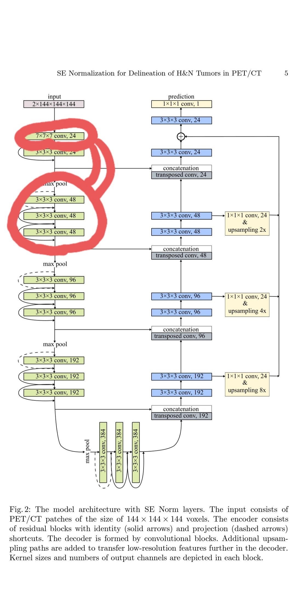
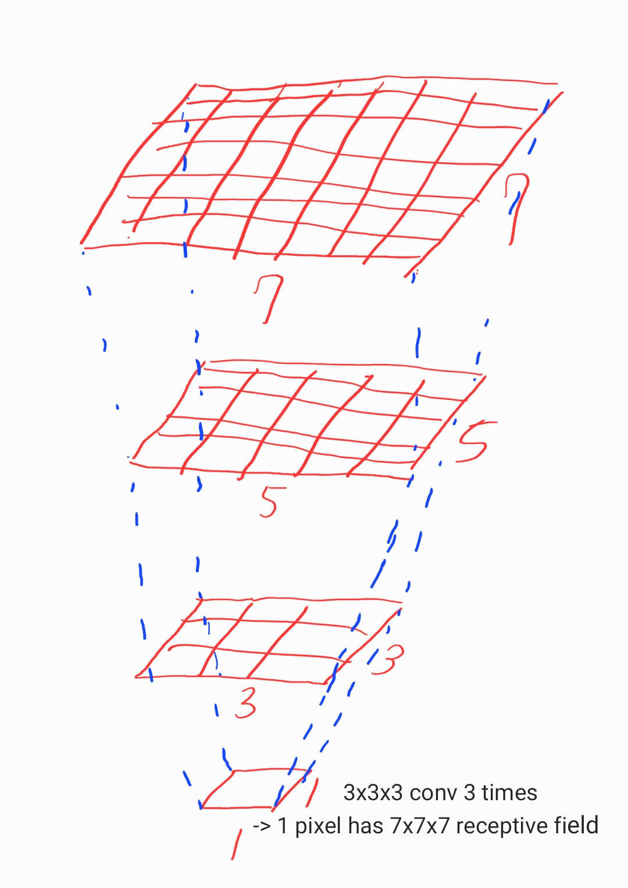

[Neural Network에서 Non-linearity가 필요한 이유](https://medium.com/ml-cheat-sheet/understanding-non-linear-activation-functions-in-neural-networks-152f5e101eeb)

결론은 ReLU가 최고고 마지막에서 softmax로 classifiction하면 됩니다.

### Receptive field

모델 앞단만 3x3x3 conv아닌 7x7x7 conv 쓰는게 있다면, 그것은 처음에 input에 대한 receptive field 를 크게 잡아서 계산량을 줄이려는 시도입니다.

3x3x3conv으로 3번하는거는 파라미터수는 줄이고 7x7x7이랑 똑같은 효과를 낼 수 있기 때문입니다.

한 픽셀을 얻어낼때 input의 3x3x3 conv 하면 3x3x3고 또하면 5x5x5 또하면 7x7x7이 됩니다. :)

  
