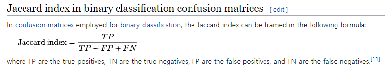

# Trainig & Testing & Result(Data Augmentation & Hyperparameters setting) & Conclusion

[Segmentation 논문 쓸 때 작성방법 참고](https://arxiv.org/pdf/1606.04797.pdf)

### Training

Our CNN is trained end-to-end on a dataset of prostate scans in MRI. An
example of the typical content of such volumes is shown in Figure 1. All the
volumes processed by the network have fixed size of 128 x 128 x 64 voxels and
a spatial resolution of 1 x 1 x 1:5 millimeters.
Annotated medical volumes are not easy to obtain due to the fact that one or
more experts are required to manually trace a reliable ground truth annotation
and that there is a cost associated with their acquisition. In this work we found
necessary to augment the original training dataset in order to obtain robustness
and increased precision on the test dataset.

During every training iteration, we fed as input to the network randomly
deformed versions of the training images by using a dense deformation field ob-
tained through a 2 x 2 x 2 grid of control-points and B-spline interpolation.
This augmentation has been performed "on-the-
y", prior to each optimisa-
tion iteration, in order to alleviate the otherwise excessive storage requirements.
Additionally we vary the intensity distribution of the data by adapting, using
histogram matching, the intensity distributions of the training volumes used
in each iteration, to the ones of other randomly chosen scans belonging to the
dataset.

### Testing

A Previously unseen MRI volume can be segmented by processing it in a feed-
forward manner through the network. The output of the last convolutional layer,
after soft-max, consists of a probability map for background and foreground. The
voxels having higher probability (> 0:5) to belong to the foreground than to the
background are considered part of the anatomy.

### Result + Augmentation & Hyperparamters 설명

We trained our method on 50 MRI volumes, and the relative manual ground
truth annotation, obtained from the "PROMISE2012" challenge dataset [7].
This dataset contains medical data acquired in different hospitals, using dif-
ferent equipment and different acquisition protocols. The data in this dataset
is representative of the clinical variability and challenges encountered in clinical settings. As previously stated we massively augmented this dataset through
random transformation performed in each training iteration, for each mini-batch
fed to the network. The mini-batches used in our implementation contained two
volumes each, mainly due to the high memory requirement of the model during
training. We used a momentum of 0:99 and a initial learning rate of 0:0001 which
decreases by one order of magnitude every 25K iterations.

### Result 부분에서도 Test data의 Ground Truth가 공개되지 않은 challenge의 경우 논문 작성 

We tested V-Net on 30 MRI volumes depicting prostate whose ground truth
annotation was secret. All the results reported in this section of the paper were
obtained directly from the organisers of the challenge after submitting the seg-
mentation obtained through our approach. The test set was representative of
the clinical variability encountered in prostate scans in real clinical settings [7].
We evaluated the approach performance in terms of Dice coeffcient, Haus-
dorff distance of the predicted delineation to the ground truth annotation and
in terms of score obtained on the challenge data as computed by the organisers
of "PROMISE 2012" [7]. The results are shown in Table 2 and Fig. 5.

Our implementation5 was realised in python, using a custom version of the
Caffe6 [5] framework which was enabled to perform volumetric convolutions via
CuDNN v3. All the trainings and experiments were ran on a standard work-
station equipped with 64 GB of memory, an Intel(R) Core(TM) i7-5820K CPU
working at 3.30GHz, and a NVidia GTX 1080 with 8 GB of video memory. We
let our model train for 48 hours, or 30K iterations circa, and we were able to
segment a previously unseen volume in circa 1 second. The datasets were first
normalised using the N4 bias filed correction function of the ANTs framework
[17] and then resampled to a common resolution of 1 x 1 x 1:5 mm. We applied
random deformations to the scans used for training by varying the position of
the control points with random quantities obtained from gaussian distribution
with zero mean and 15 voxels standard deviation. Qualitative results can be seen
in Fig. 4.

### Conclusion & Future works

We presented and approach based on a volumetric convolutional neural network
that performs segmentation of MRI prostate volumes in a fast and accurate man-
ner. We introduced a novel objective function that we optimise during training
based on the Dice overlap coeffcient between the predicted segmentation and the
ground truth annotation. Our Dice loss layer does not need sample re-weighting
when the amount of background and foreground pixels is strongly unbalanced
and is indicated for binary segmentation tasks. Although we inspired our archi-
tecture to the one proposed in [14], we divided it into stages that learn residuals
and, as empirically observed, improve both results and convergence time. Fu-
ture works will aim at segmenting volumes containing multiple regions in other
modalities such as ultrasound and at higher resolutions by splitting the network
over multiple GPUs.

# CNN Properties

Shallower layers grasp local information while deeper layers use flters whose receptive felds are much broader that therefore capture global information

# CNN in Medical Field

CNNs have been recently used for medical image segmentation. Early approaches obtain anatomy delineation in images or volumes by performing patch-
wise image classification. Such segmentations are obtained by only considering local context and therefore are prone to failure, especially in challenging modalities such as ultrasound, where a high number of mis-classified voxel are to be expected. Post-processing approaches such as connected components analysis
normally yield no improvement and therefore, more recent works, propose to
use the network predictions in combination with Markov random fields [6], voting strategies [9] or more traditional approaches such as level-sets [2]. Patch-wise
approaches also suffer from effciency issues. When densely extracted patches are processed in a CNN, a high number of computations is redundant and therefore
the total algorithm runtime is high. In this case, more effcient computationalschemes can be adopted.

# Deep Neural Network Initialization

In deep networks with many convolutional layers and different paths through

the network, a good initialization of the weights is extremely important. 

Otherwise, parts of the network might give excessive activations, while other parts never contribute. 

Ideally the initial weights should be adapted such that each feature map in the network has approximately unit variance. 

For a network with our architecture (alternating convolution and ReLU layers) this can be achieved

by drawing the initial weights from a ***Gaussian distribution*** with a standard deviation of...

---

# Data Augmentation

Data augmentation is essential to teach the network the desired invariance and

robustness properties, when only few training samples are available. In case of

microscopical images we primarily need shift and rotation invariance as well as

robustness to deformations and gray value variations. Especially random elastic deformations of the training samples seem to be the key concept to train a segmentation network with very few annotated images.

We generate smooth deformations using random displacement vectors on a coarse 3 by 3 grid. 

The displacements are sampled from a Gaussian distribution with 10 pixels standard deviation. 

Per-pixel displacements are then computed using bicubic interpolation. 

Drop-out layers at the end of the contracting path perform further implicit data augmentation.

ex)

The transformations used by [35, 43, 32] include shifting, rotating and

scaling images, as well as augmenting grey values. One transformation cited in each of the three

papers is the application of a random deformation field. This random deformation field is applied to

the image at the beginning of each training iteration. Hence, in every epoch, the network is training

on a different version of the original data set.

## Data Augmentation in Biomedical Segmentation 

As for our tasks there is very little training data available, we use excessive

data augmentation by applying elastic deformations to the available training im-

ages. This allows the network to learn invariance to such deformations, without

the need to see these transformations in the annotated image corpus. This is

particularly important in biomedical segmentation, since deformation used to

be the most common variation in tissue and realistic deformations can be simu-

lated effciently. The value of data augmentation for learning invariance has been

shown in Dosovitskiy et al. [Discriminative un- supervised feature learning with convolutional neural networks](https://arxiv.org/pdf/1406.6909.pdf)

in the scope of unsupervised feature learning.

# Max pooling vs Stride

Strided convolution is used in

place of max-pooling as it was found to yield slightly better results in the preliminary experiments.

[Striving for Simplicity: The All Convolutional Net](https://arxiv.org/pdf/1412.6806.pdf)

[Visualizing and understanding convolutional networks](https://arxiv.org/pdf/1311.2901.pdf)

---

# Semantic Segmentation

Semantic Segmentation by that we refer to ***classifying individual pixel*** rather than classifying an image as a cat or a dog but in this case we are classifying individual pixels that belong to a cat or a dog

---

# Dice Simliarity Coefficient and Jaccard index

Another limitation stems from the fact that both

the dice coefficient and the Jaccard index are only defined for binary maps.

[Dice Loss layer 부분 참고](https://arxiv.org/pdf/1606.04797.pdf)

The network predictions, which consist of two volumes having the same resolution as the original input data, are processed through a soft-max layer which
outputs the probability of each voxel to belong to foreground and to background.
In medical volumes such as the ones we are processing in this work, it is not uncommon that the anatomy of interest occupies only a very small region of the
scan. This often causes the learning process to get trapped in local minima of the loss function yielding a network whose predictions are strongly biased towards background. As a result the foreground region is often missing or only partially detected. Several previous approaches resorted to loss functions based
on sample re-weighting where foreground regions are given more importance than background ones during learning. In this work we propose a novel objective function based on dice coeffcient, which is a quantity ranging between 0 and 1 which we aim to maximise. The dice coeffcient D between two binary volumes can be written as

---

# Segmentation Loss Function

DSC, Jaccard Loss, categorical cross-entropy, Focal Loss

IOU = TP / (TP + FP + FN) = Jaccard Index

---

# categorical cross-entropy

a loss function that corresponds to the maximum likelihood solution of a multiclass classification problem. 

It is defined as: H(t; p) = 􀀀
P
t(x) log(p(x)), p and t corresponding to “prediction” and “target”.

Turning to the least frequent two classes

“middle” and “distal”, it becomes clear that the network trained on categorical cross-entropy is far

less capable of learning to detect highly infrequent classes, which can be explained by the fact that

categorical cross-entropy corresponds to a maximum likelihood solution: the network gets biased

towards more frequent classes, as this increases the likelihood of the training data.

It was shown before in Table 1 that the classes “middle” and “distal” are the least common of all four foreground

labels due to their smaller size. While the class imbalance could be countered by using weight maps

wherein less frequent classes are associated with higher weights, this would introduce an additional

hyper-parameter optimization problem. In order to avoid this, the Jaccard distance was used in all

of the ensuing experiments.

---

# U-net Skip connection

U-net에서 Contracting path를 skip connection으로 Expanding path에 concatenate하는 이유는 image가 Downsampling하면서 잃어버리는 local details를 보전하기 위해서입니다.

An important part of the network described in U-Net are long skip connections forwarding feature

maps from the contracting stage to the expanding stage. These allow the network to recover

local details which are lost due to the usage of downsampling operations. In order to justify the

inclusion of long skip connections, the network was trained and tested on the hand MRI data set

described in Section 3 with and without long skip connections. The results of this experiment are

summarized in Fig. 8. It was revealed that removing long skip connections unambiguously worsens

the performance of the network.

Next, the network was trained and tested using two different types of long skip connections: concatenation

and element-wise summation. Six cross-validation folds were used in order to get a sound

comparison. The training and validation curves of all of the folds are collected in Fig. 11. The results

suggest that the summation network is outperformed in all cross-validation folds. In order to confirm

this, the test set dice scores obtained by the networks were averaged over all six cross-validation

folds. These values, along with the curve of the validation loss achieved by each network averaged

over all folds are visualized in Fig. 12. Like the single-fold learning curves, these plots suggest that

concatenation works better than element-wise summation when used in long skip connections.

### Performance Comparison : Concatenation > Summation > Cross Validation

**The visualized features suggest that, while summing features from the expanding and contracting**

**stages directly inserts local information into the feature maps, it also causes a high amount of irrelevant**

**detail to be re-introduced into the information stream of the network, making it difficult for**

**the network to selectively combine both types of information. By comparison, the concatenation**

**network seems to benefit from keeping separate streams of information: one set of feature maps**

**containing segmentation maps for the individual classes and another set containing local details.**

### Training networks on different combinations of modalities could improve Dice Score

Comparing the results of this run with the performance of the network when all modalities are available shows that, interestingly,

the network achieves a much higher dice score on necrotic regions when the T1 modality

is discarded. This suggests that some benefit could be achieved by training different networks on

different combinations of MRI modalities.

[CNN-based Segmentation of Medical Imaging Data](https://arxiv.org/pdf/1701.03056.pdf)
